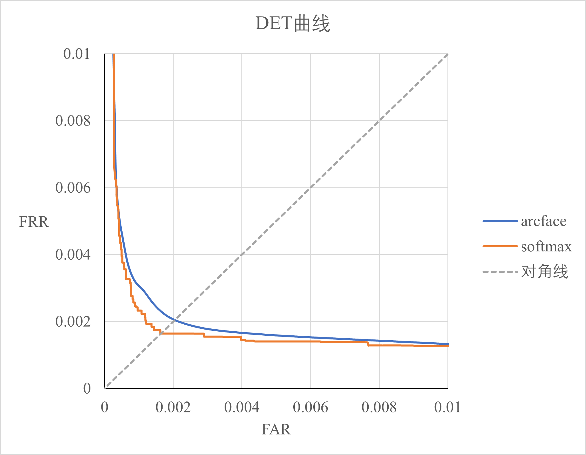

# 基于Resnet18模型在MNIST数据集上复现ArcFace
近期我了解到ArcFace Loss在人脸识别算法中有着重大影响，截止2024.9.4引用量达到了7080，因此我想复现这篇经典文章。MNIST数据集是比较简单，容易处理的数据集，因此基于它来完成复现实验。

文章完整的标题为：ArcFace: Additive Angular Margin Loss for Deep Face Recognition
发表于CVPR2019

官方的代码库为：https://github.com/deepinsight/insightface/tree/master/recognition/arcface_torch

我的运行环境如下：

> python==3.8.0  
> pytorch==1.11.0  
> torchvision==0.12.0  
> ubuntu==22.04  
> GPU==RTX 3090  

## 1 使用ArcFace Loss训练Resnet18
修改main.py中的flag为flag1后，运行:  
> python main.py

运行过程中的参数可以在 `trainArcFace.py`的`TrainArcFaceParams`中修改

## 2 使用常规方法训练Resnet18
修改main.py中的flag为flag2后，运行:  
> python main.py

运行过程中的参数可以在 `trainResnet.py`的`TrainResnetParams`中修改

## 3 测试
将`trainArcFace.py`或者`trainResnet.py`中的`trainArcFaceMain`或`trainResnetSoftmaxMain` 注释掉, 然后运行`python main.py`即可

## 4 实验结果
### 4.1 arcface
在第32个epoch时有着最小的验证损失值，此时获得最好的模型。此时的模型在测试集上的精度为99.58%，等错误率EER为0.20%，DET曲线如下图中蓝色曲线所示；

### 4.2 常规方法（softmax）
此外，为了对比arcface loss与常规训练分类器方法的性能，我以常规方法（直接对模型输出的预测分数logits使用softmax函数转变为各个类别的预测概率，然后使用交叉熵损失函数训练）训练了一个模型，它的精度为99.66%，等错误率EER为0.16%，DET曲线如下图中橙色曲线所示。

 