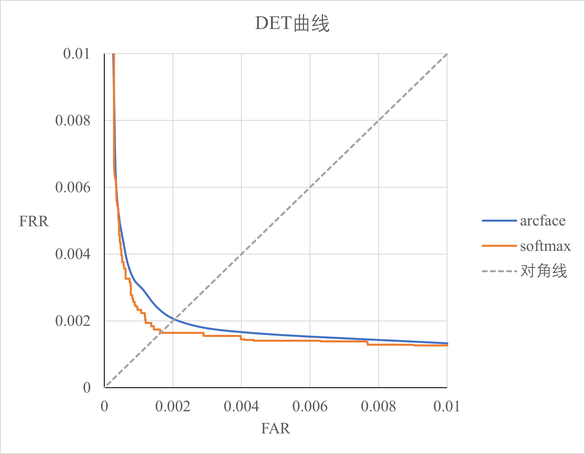

## [简体中文](readme.md) | English

# Implemeting ArcFace on MNIST dataset with Resnet18
Recently, I have learned that ArcFace is an important algorithm in the field of face recognition. Its citation is 7080 up to Sep, 4 2024. Then, I intent to implement this algorithm by myself on MNIST dataset. The MNIST dataset is so easy to pre-process that can facilitate our implementation process.

The complete title of the paper for ArcFace is : `ArcFace: Additive Angular Margin Loss for Deep Face Recognition`, and this paper was published on `CVPR2019`.

The official code repository is : https://github.com/deepinsight/insightface/tree/master/recognition/arcface_torch

The running environment for my experiments is：

> python==3.8.0  
> pytorch==1.11.0  
> torchvision==0.12.0  
> ubuntu==22.04  
> GPU==RTX 3090  

## 1 Training Resnet18 with ArcFace
After updating the flag in main.py as `flag1`, we can run the following command:
> python main.py

We can modify the related parameters in `TrainArcFaceParams` of `trainArcFace.py`.

## 2 Training Resnet18 with regular classification loss
After updating the flag in main.py as `flag2`, we can run the following command:
> python main.py

We can modify the related parameters in `TrainResnetParams` of `trainResnet.py`.

## 3 Test our model
After commenting out the code for training, we can run `python main.py` to test our model.

## 4 Experimental Results
### 4.1 Arcface
We obtain the best model with smallest validatation loss value on 32-th epoch. 

The accuracy and EER on test set is 99.58% and 0.20%, repectively. 

Furthermore, we draw the DET curve in the following figure, as the blue curve shows.

### 4.2 Regular classification loss（softmax + cross entropy loss）
To compare arcface loss and regular classification loss, we train Resnet18 with regular classification loss in section 2.

Regular classification loss means that transforming the predicting logits to probability scores on each class with softmax function and using cross entropy loss to train our model.

The accuracy and EER on test set is 99.66% and 0.16%, repectively.

we draw the DET curve in the following figure, as the orange curve shows.

It seems that the arcface doesn't work well on MNIST dataset.
In the future, I will try to implement ArcFace on some face datasets.

 